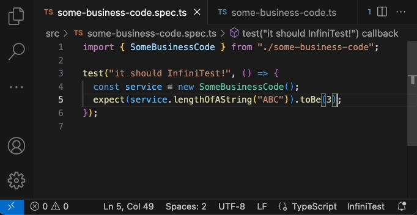

# Infini Test - VS Code Extension

Inspired by Eclipse's Infintest, the OGs will know !

## Features

- ✅ Run associated test : e.g. on save `some-business-code.ts` will look for `some-business-code.spec.ts`
- ✅ Run current test if :
  - filename matches `*.spec.ts` : `npm run test -- <fileName>`
  - filename matches `*.e2e-spec.ts` : `npm run test:e2e --t <fileName>`
- ✅ Will display `x Test not found` if no test file is found
- ✅ Will display `InfiniTest` if current file is not a typescript file
- ⚠️ Adding a shortcut to switch back and forth between the test file and the tested file for on specs (aka unit test)
- ⚠️ When test result changes, make a slick color animation
- ⚠️ Store history of tests and results on click on the bottom right extension in the status bar

## Demo

## Development environment

- Clone this repo
- Open in VS Code - it will be detected as a VS Code extension source code
- Press F5 to run - it will open a new VSCode window with the extension build from source code. The opened folder is an "integration" test.

## How to release

- Push to Github
- Bump version in `package.json`
- `vsce package`
- `vsce publish`
